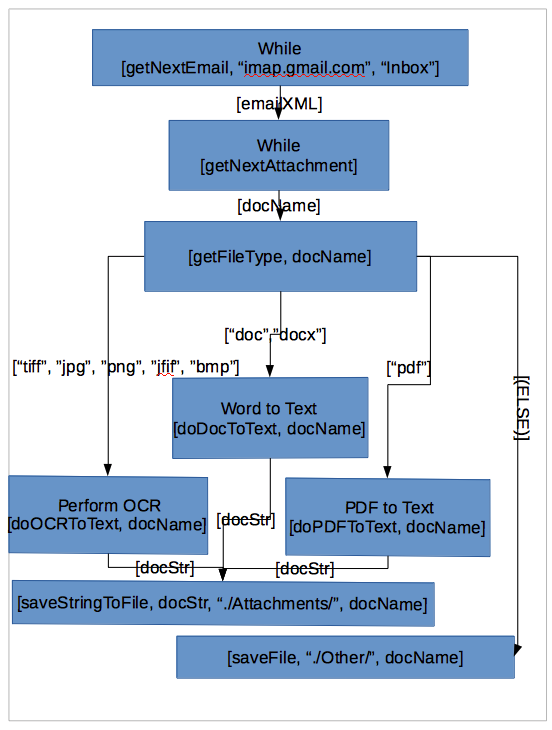

# GoDocRouter
DocRouter written in Golang

Golang Framework that routes document images through a configurable workflow process.

This workflow defines the order of events by utilizing the Open Source designer tool, <a href=https://en.wikipedia.org/wiki/LibreOffice>LibreOffice</a>, with corresponding connected shapes.

  

One transformation defined in the workflow as illustrated above, doOCRToText, will perform Optical Character Recognition on supplied document images utilizing the <b><a href=https://en.wikipedia.org/wiki/Tesseract_(software)>Tesseract-OCR</a></b> library.

<b>To install and run the attached Golang prototype:</b>

<b>Step 1:</b>  Download and unzip the attached GoDocRouter Application by clicking the corresponding 'Clone or Download...' green button and then select 'Download Zip'.

<b>Step 2:</b>  Install the necessary Golang compiler that you can find <b><a href=https://golang.org/dl/>here.</a></b>

<b>Step 3:</b>  Open a command-line/terminal window and change your current directory where the files have been unzipped.

<b>Step 4:</b>  Type the following to compile and run - >go run CADEngine.go

